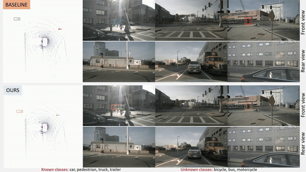
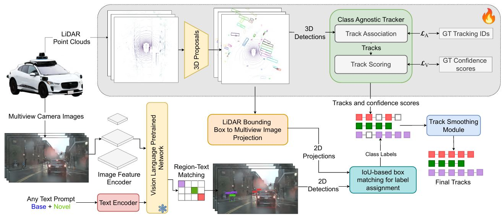

# Open3DTrack: Towards Open-Vocabulary 3D Multi-Object Tracking

[](https://arxiv.org/link-to-your-paper)  
<!--  -->
<p align="center">  </p>


## Abstract
3D multi-object tracking plays a critical role in autonomous driving by enabling the real-time monitoring and prediction of multiple objects’ movements. Traditional 3D tracking systems are typically constrained by predefined object categories, limiting their adaptability to novel, unseen objects in dynamic environments. To address this limitation, we introduce open-vocabulary 3D tracking, which extends the scope of 3D tracking to include objects beyond predefined categories. We formulate the problem of open-vocabulary 3D tracking and introduce dataset splits designed to represent various open-vocabulary scenarios. We propose a novel approach that integrates open-vocabulary capabilities into a 3D tracking framework, allowing for generalization to unseen object classes. Our method effectively reduces the performance gap between tracking known and novel objects through strategic adaptation. Experimental results demonstrate the robustness and adaptability of our method in diverse outdoor driving scenarios. To the best of our knowledge, this work is the first to address open-vocabulary 3D tracking, presenting a significant advancement for autonomous systems in real-world settings.

<p align="center">  </p>

---

## Getting Started

Clone the repository and submodules:
```bash
git clone --recurse-submodules https://github.com/ayesha-ishaq/Open3DTrack
```

### Environment Setup

1. **Create and activate the Conda environment**:
    ```bash
    conda create -n open3dtrack python=3.10
    conda activate open3dtrack
    ```

2. **Install dependencies**:
    ```bash
    pip install ultralytics
    conda install pytorch==1.13.1 torchvision==0.14.1 torchaudio==0.13.1 pytorch-cuda=11.6 -c pytorch -c nvidia
    pip install nuscenes-devkit matplotlib pandas motmetrics==1.1.3
    conda install pyg -c pyg
    pip install pyg_lib torch_scatter torch_sparse torch_cluster torch_spline_conv -f https://data.pyg.org/whl/torch-1.13.0+cu116.html
    ```

3. **Install third-party dependencies**:  
   Refer to [this repository](https://github.com/dsx0511/3DMOTFormer.git) for additional installations.

---

## Dataset Preparation

1. **Download NuScenes dataset**: [NuScenes](https://www.nuscenes.org/download) (Keyframes only)
2. **Generate YOLOWorld Detections**:
Set the `$dataset_dir` in `yoloworld.py` to <path_to_nuscenes> `$output_dir` to <path_to_save_2D_detections>
    ```bash
    python yoloworld.py
    ```

3. **3D Detector Detections**:
   - [CenterPoint Detection](https://mitprod-my.sharepoint.com/:f:/g/personal/tianweiy_mit_edu/Eip_tOTYSk5JhdVtVzlXlyABDPnGx9vsnwdo5SRK7bsh8w?e=vSdija)
   - [Megvii Detection](https://www.nuscenes.org/data/detection-megvii.zip)
   - [BEVFusion Detection](https://github.com/mit-han-lab/bevfusion) (To obtain BEVFusion results, you must install BEVFusion and run inference. Alternatively you can use BEVFusion from [mmdetection3d](https://github.com/open-mmlab/mmdetection3d/tree/main/projects/BEVFusion))

4. **Generate Split Data**:
    To preprocess 3D and 2D detections and obtain data for 3D tracker run: 
    Split scenarios are as proposed in the paper: *rare*, *urban*, and *diverse*. Set <split_name> to one of these.
    ```bash
    python generate_data_yoloworld.py \
    --dataset_dir <path_to_nuscenes> \
    --detection_dir <path_to_3D_detections> \
    --output_dir <path_to_output> \
    --yoloworld_dir <path_to_yoloworld_detections> \
    --data_split_scenario <split_name> --apply_nms
    ```

---

## Training and Evaluation

1. **Update Config File**:  
   Set paths for dataset and processed data in `config/default.json`, and set field `split` to the desired scenario (*rare*, *urban*, *diverse*)

2. **Training**:
    ```bash
    python train.py -c config/default.json
    ```

3. **Evaluation**:
    ```bash
    python train.py -c config/default.json -r <path_to_checkpoint> --eval_only -o <path_to_result_folder>
    ```

---

## Experimental Results

| Split | AMOTA | AMOTP | Bicycle | Bus  | Car  | Motorcycle | Pedestrian | Trailer | Truck | Checkpoint|
|-------|-------|-------|---------|------|------|------------|------------|---------|-------|-------|
| Rare  | 0.578 | 0.783 | **0.445**   |**0.612**| 0.779| **0.469**      | 0.752      | 0.477   | 0.511 | [weights]()
| Urban | 0.590 | 0.677 | **0.400**   | **0.683**| 0.788| 0.702      | **0.548**      | 0.488   | 0.522 | [weights]()
| Diverse | 0.536| 0.804 | 0.524   | 0.770| 0.708| **0.438**      | **0.564**      | 0.470   | **0.276** |[weights]()
| **UpperBound** (3DMOTFormer) | 0.710 | 0.521 | 0.545 | 0.853 | 0.838 | 0.723 | 0.812 | 0.509 | 0.690 |

##### AMOTA and AMOTP show overall results while only AMOTA results are shown for each class here. Bold values indicate novel classes of that split.
---


